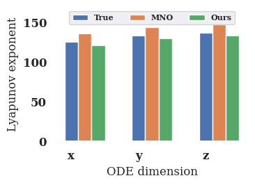

# Updates to Reviewer BWmX

| Lyapunov Exponent Spectra                            | Spatial correlation visualization                                             | Our prediction on L63 trajectory              |
| ---------------------------------------------------- | ----------------------------------------------------------------------------- | ---------------------------------------------- |
|  |  |  |

# ChaosMeetsAttention

Dataset details of the paper  "Chaos Meets Attention: Transformers for Large-Scale Dynamical Prediction".

The dataset sample of Turbulent Channel Flow is available via the link ([https://filebin.net/14cqtikd5le3sjw5 ]))

# Code submission to ICML 2025

The code is devloped for modeling large-scale chaos, modifying the base code from the repo [FactFormer](https://github.com/BaratiLab/FactFormer).

Please incorporate datasets into the `/data` folder and define your local path before you start training or evaluation.

We suggest you try with requesting a GPU card memory larger than 24GB when training.

