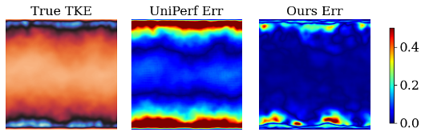

# Rebuttal materials to the reviewers of ICML 2025 submission No. 2640

- [Updates to reviewer vgH9](#updates-to-reviewer-vgh9)
  - [A. Computational cost comparison](#a-computational-cost-comparison) (Related to reviewers **FGZz, ARTA**)
  - [B. Unitary performer performance on TCF benchmark](#b-unitary-performer-performance-on-tcf-benchmark)
    - [References](#references)
- [Updates to reviewer ARTA](#updates-to-reviewer-arta) (Related to reviewers **vgH9, BWmX**)
- [Updates to Reviewer BWmX](#updates-to-reviewer-bwmx) (Related to reviewers **vgH9**)
  - [A. New updates! Extending to ODE case Lorenz 63](#a-extending-to-ode-case-lorenz-63)
  - [B. Table 1&amp;2 with error bars and KL Divergence](#b-updated-table-12-with-error-bars-and-kl-divergence)
  - [Reference](#reference-list)
- [Updates to ALL : integrating performer attention in our setting (Unitary Performer).](#updates-to-all--integrating-performer-attention-in-our-setting-unitary-performer)

# Updates to reviewer vgH9

## A. Computational cost comparison

### Additional table 1. **Grid Resolution Scaling** - We report the model's performance across a range of grid resolutions to demonstrate scalability. The results are gathered on the KF256 dataset.

| Grid Resolution | Parameter count | Runtime | Memory usage | FLOPs per forward pass |
| --------------- | --------------- | ------- | ------------ | ---------------------- |
| 32x32           | 7325665         | 24ms    | 174MB        | 2.5GB                  |
| 64x64           | 7325665         | 27ms    | 537MB        | 10.5GB                 |
| 128x128         | 7325665         | 42ms    | 1986MB       | 50.2GB                 |
| 256x256         | 7325665         | 58ms    | 7684MB       | 268GB                  |

### Additional table 2. **Computational Cost among baselines and Performer attention** - We report the computational cost for each model, the results are gathered on the TCF dataset.

| Models                      | Parameter count   | Runtime         | Memory usage     | FLOPs per forward pass |
| --------------------------- | ----------------- | --------------- | ---------------- | ---------------------- |
| MNO                         | 6467425           | 31ms            | 377MB            | 3.45GB                 |
| UNO                         | 17438305          | 12ms            | 769MB            | 6.88GB                 |
| MWT                         | 5089153           | 50ms            | 313MB            | 9.52GB                 |
| FactFormer                  | 6083009           | 53ms            | 6889MB           | 239GB                  |
| Ours                        | 7325665           | 58ms            | 7684MB           | 268GB                  |
| **Unitary Performer** | **7717931** | **111ms** | **2938MB** | **271GB**        |

## B. Unitary performer performance on TCF benchmark

| Models  | τ = 5 | τ = 25 | ME-APE | ME-LRw | Δλ | KLD    |
| ------- | ------ | ------- | ------ | ------ | ---- | ------ |
| UniPerf | 0.20   | 1.00    | 0.98   | 4.05   | 0.09 | 113.20 |

## C. Mean pooling vs A3M pooling on KF256 benchmark

| Models     | τ = 5 | τ = 25 | ME-APE | ME-LRw | Δλ | KLD  |
| ---------- | ------ | ------- | ------ | ------ | ---- | ---- |
| Axial-Mean | 0.99   | 1.30    | 0.16   | 0.21   | 0.10 | 0.41 |
| A3M        | 0.86   | 1.27    | 0.10   | 0.15   | 0.08 | 0.29 |

    * A3M pooling outperforms mean pooling primarily due to its ability to accurately capture extreme values, which are crucial for chaos prediction. This results in better short-term accuracy, improved long-term distribution fitting, and preservation of the energy spectrum.

### References

[1] Hasselblatt, Boris, and Anatole Katok, eds. *Handbook of dynamical systems*. Elsevier, 2002.

[2] Tolstikhin, Ilya O., Bharath K. Sriperumbudur, and Bernhard Schölkopf. "Minimax estimation of maximum mean discrepancy with radial kernels." Advances in Neural Information Processing Systems 29 (2016).

[3] Chen, Jianfei, et al. "Population matching discrepancy and applications in deep learning." Advances in Neural Information Processing Systems 30 (2017).

[4] Muandet, Krikamol, et al. "Kernel mean embedding of distributions: A review and beyond." Foundations and Trends® in Machine Learning 10.1-2 (2017): 1-141.

[5] Meyer, Raphael A., et al. "Hutch++: Optimal stochastic trace estimation." Symposium on Simplicity in Algorithms (SOSA). Society for Industrial and Applied Mathematics, 2021.

[6] Jiang, Ruoxi, et al. "Training neural operators to preserve invariant measures of chaotic attractors." Advances in Neural Information Processing Systems 36 (2023): 27645-27669.

[7] Schiff, Yair, et al. "DySLIM: dynamics stable learning by invariant measure for chaotic systems." Proceedings of the 41st International Conference on Machine Learning. 2024.

# Updates to reviewer ARTA

| Figure. Eigenvalue of the learnt operators with/without Hutchinson’s trace estimation to approxiamte unitarity.  |
| ---------------------------------------------------------------------------------------------------------------------------------------------------------------- |

# Updates to Reviewer BWmX

## A. Extending to ODE case Lorenz 63 (Updated on 7th April)

Many thanks for the guidance from reviewer BWmX about the expected Lyapunov Exponent on the typical L63 system. We checked the calculation details and implemented one [thanks to this tutorial](http://www.chebfun.org/examples/ode-nonlin/LyapunovExponents.html). 

We'd like to report the results in the updated table below and the figure of the visualization of the max lyapunov exponent imapct on the separation of state distance (in  magnitute) on the nearby trajectories (with initial state [1,1,1] and a pertubation in 5e-5)

|    Lorenz63    | Max Lyapunov Exponent |
| :------------: | --------------------: |
|   True Data   |                 0.906 |
| MNO Prediction |                  1.16 |
| Our Prediction |                 0.825 |

| ~~Lorenz63~~       | ~~Mean Lyapunov Exponent~~ | ~~Max Lyapunov Exponent~~ | ~~Lyapunov Time~~ |
| ------------------- | ---------------------------: | -------------------------: | -----------------: |
| ~~True Data~~      |                  ~~132.52~~ |                ~~137.84~~ |        ~~7.5e-3~~ |
| ~~MNO Prediction~~ |                  ~~143.07~~ |                ~~148.41~~ |        ~~6.9e-3~~ |
| ~~Our Prediction~~ |                  ~~128.61~~ |                ~~133.92~~ |        ~~7.7e-3~~ |

| ~~Lyapunov Exponent Spectra~~ Updates: Magnitude of separation of L63 nearby trajectories  by initial small pertubation in 5e-5 on the initial state $u_0$= [1,1,1] | Spatial correlation visualization                                             | Our prediction on L63 trajectory (this is a .gif file, which may appear static in a .pfd file) |
| ---------------------------------------------------------------------------------------------------------------------------------------------------------------------------------- | ----------------------------------------------------------------------------- | ---------------------------------------------------------------------------------------------------- |
|                                                                                                                |  |                                                        |

## B. Table 1&2 with error bars and KL Divergence

**Updated Table 1.** Short-term accuracy standard deviation updates and long-term performance of baselines and our transformer prediction on KF256.

| Models                  | τ = 5                    | τ = 25                   | ME-APE                    | ME-LRw                    | Δλ                      | KLD                       |
| ----------------------- | ------------------------- | ------------------------- | ------------------------- | ------------------------- | ------------------------- | ------------------------- |
| MNO                     | 1.02 ± 1.5E-02           | 1.29 ± 1.5E-02           | 0.42 ± 6.1E-05           | 0.70 ± 4.8E-05           | 0.40 ± 4.9E-05           | 0.42 ± 7.8E-05           |
| UNO                     | 0.92 ± 7.5E-02           | 1.32 ± 1.6E-02           | 0.22 ± 8.3E-06           | 0.36 ± 3.5E-05           | 0.11 ± 1.5E-05           | 0.38 ± 9.5E-06           |
| MWT                     | 0.95 ± 5.2E-03           | 1.32 ± 6.4E-03           | 0.26 ± 6.2E-05           | 0.39 ± 2.9E-05           | 0.17 ± 1.0E-05           | 0.40 ± 3.7E-05           |
| FactFormer              | 0.97 ± 8.3E-03           | 1.35 ± 1.2E-02           | 0.13 ± 1.5E-05           | 0.19 ± 8.1E-05           | 0.10 ± 7.8E-06           | 0.37 ± 5.5E-05           |
| **Ours**          | **0.86 ± 8.1E-03** | **1.27 ± 4.3E-03** | **0.10 ± 5.8E-06** | **0.15 ± 1.4E-05** | **0.08 ± 6.2E-06** | **0.29 ± 8.3E-06** |
| **Advantage (%)** | **6.52 ± 6.0E-01** | **1.55 ± 5.8E-01** | **23.1**            | **21.0**            | **20.0**            | **21.6**            |

**Updated Table 2.** Short-term accuracy standard deviation updates and long-term prediction performance of baselines and our transformer predictions for TCF.

| Models                  | τ = 5                    | τ = 25                   | ME-APE                    | ME-LRw                    | Δλ                      | KLD                       |
| ----------------------- | ------------------------- | ------------------------- | ------------------------- | ------------------------- | ------------------------- | ------------------------- |
| MNO                     | 0.08 ± 9.8E-03           | 0.24 ± 4.9E-03           | 0.84 ± 4.7E-04           | 1.95 ± 8.3E-04           | 0.11 ± 7.5E-05           | 3.73 ± 6.3E-04           |
| UNO                     | 0.07 ± 8.4E-03           | 0.19 ± 8.1E-03           | 0.86 ± 7.0E-04           | 2.07 ± 4.5E-04           | 0.12 ± 6.8E-05           | 4.89 ± 4.3E-04           |
| MWT                     | 0.04 ± 8.7E-03           | 0.14 ± 8.0E-03           | 0.21 ± 8.3E-05           | 0.19 ± 8.1E-05           | 0.11 ± 4.6E-05           | 2.70 ± 7.2E-05           |
| FactFormer              | 0.09 ± 7.0E-03           | 0.17 ± 6.7E-03           | 0.13 ± 6.8E-05           | 0.12 ± 7.3E-05           | 0.23 ± 3.1E-05           | 3.34 ± 3.4E-04           |
| **Ours**          | **0.03 ± 7.6E-03** | **0.13 ± 6.3E-03** | **0.09 ± 6.0E-06** | **0.09 ± 8.4E-06** | **0.08 ± 5.2E-05** | **1.97 ± 6.3E-05** |
| **Advantage (%)** | **25.0 ± 7.7E-01** | **7.14 ± 4.0E-01** | **30.8**            | **25.0**            | **27.3**            | **27.0**            |

### Reference List

   [1] Li, Zongyi, et al. "Learning chaotic dynamics in dissipative systems." *Advances in Neural Information Processing Systems* 35 (2022): 16768-16781
   [2] Schiff, Yair, et al. "Dyslim: Dynamics stable learning by invariant measure for chaotic systems." arXiv preprint arXiv:2402.04467 (2024).
   [3] Jiang, Ruoxi, et al. "Training neural operators to preserve invariant measures of chaotic attractors." Advances in Neural Information Processing Systems 36 (2023): 27645-27669.

# Updates to ALL : integrating performer attention in our setting (Unitary Performer).

Performer attention is widely applied in language models. We, the authors, are interested in its performance on the physics modality, such as the TCF benchmark. It is worth noting that we have smoothly integrated Performer attention into our framework, using the same configuration, setting the unitary operator, and applying the loss function. However, introducing this attention mechanism to the physics modality from language model settings requires meticulous checks and further validation.

Our implementation is a non-official version, made possible thanks to the [open-source contribution](https://github.com/lucidrains/performer-pytorch/tree/main), which is unrelated to us, the authors, and is available under the MIT License for rebuttal discussion on applying Performer in physics modalities.

Based on this foundation, we share some interesting preliminary results with the reviewers in the following figures. We also include the code (`./tcf_uniperf.py`) for reviewers who may wish to experiment with the TCF dataset. The dataset sample link is provided below (approximately 40GB).

| Figure. Visualization results of substituting A3M with Performer attention (UniPerf) on TCF benchmark.                                                                                                                                                                                                                                                                                                                         |
| ------------------------------------------------------------------------------------------------------------------------------------------------------------------------------------------------------------------------------------------------------------------------------------------------------------------------------------------------------------------------------------------------------------------------------ |
| With Performer attention, the model matches the energy spectrum in high frequencies better than MNO; the model predictions only correlate to recent 5 steps indicating a faster decay rate than the truth;  the TKE error of the predicted $yoz$-crosssection concentrates on the top-bottom boundary,  which indicates a potential failure in accurately capturing such axial information compared with A3M. |

| (a) Energy spectrum                                | (b) Time correlation                           | (c) TKE                                              |
| -------------------------------------------------- | ---------------------------------------------- | ---------------------------------------------------- |
|  |  |  |

# Others: ChaosMeetsAttention

Dataset details of the paper  "Chaos Meets Attention: Transformers for Large-Scale Dynamical Prediction".

The dataset sample of Turbulent Channel Flow is available via the link (https://filebin.net/37p4dxup0t320143)

# Others: Code submission to ICML 2025

The code is devloped for modeling large-scale chaos, modifying the base code from the repo [FactFormer](https://github.com/BaratiLab/FactFormer).

Please incorporate datasets into the `/data` folder and define your local path before you start training or evaluation.

We suggest you try with requesting a GPU card memory larger than 24GB when training.
